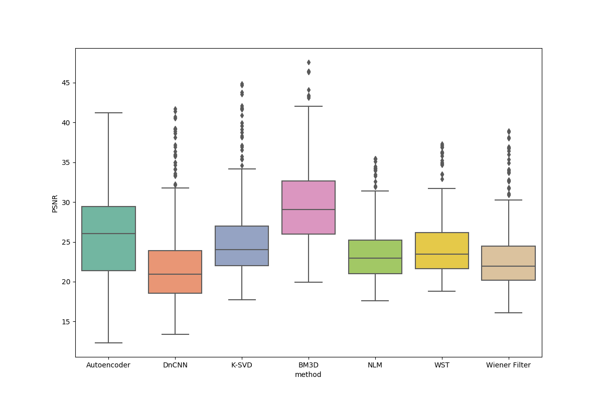
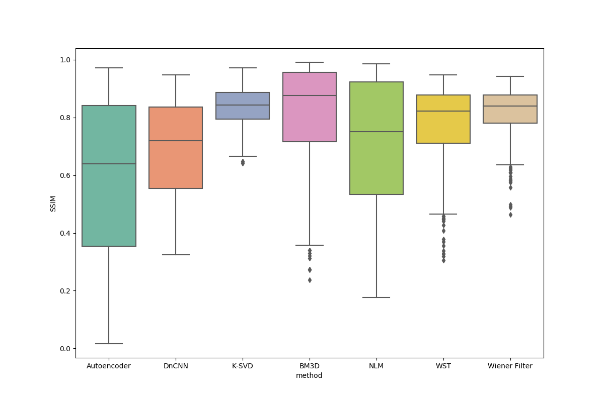
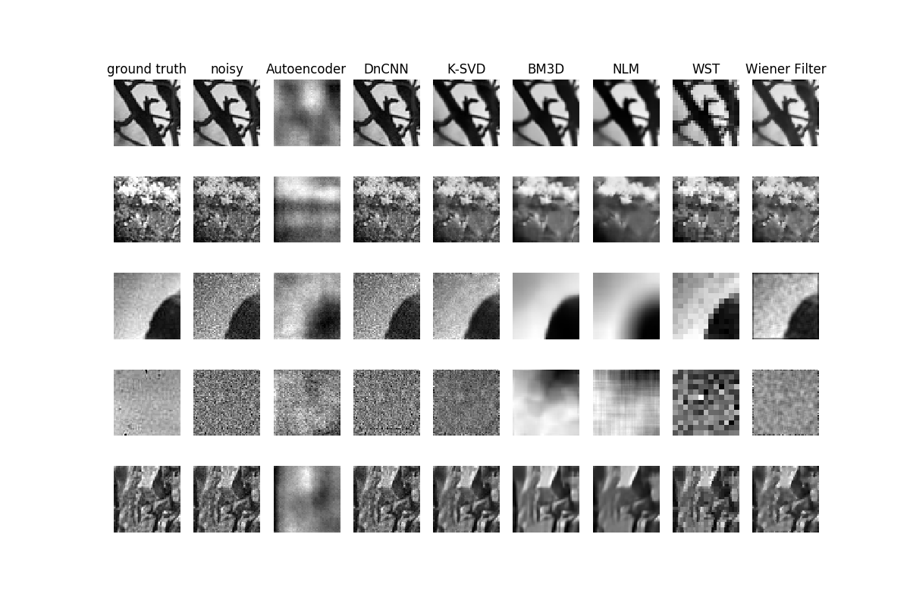
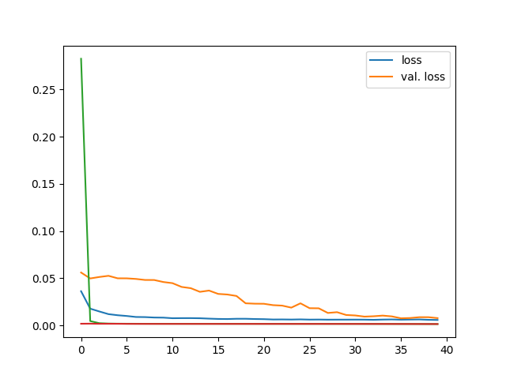

# Gaussian

This experiment is about compare traditional methods in relation to PSNR and SSIM metrics, on Gaussian noise, with mean 0 and std = 0.1.

Experiment started at 2021/02/25 03:34:02 and ended at 2021/02/25 04:13:54, during 2392.48 seconds.

| Methods | Dataset | Training samples | Test samples | Dimension |
|---|---|---|---|---|
| Autoencoder,DnCNN,K-SVD,BM3D,NLM,WST and Wiener Filter | BSD300 | 2400 | 600 | 52 X 52 |

# 1. Results

## 1.1 Table

We could see the results through the table, comparing all the methods in relation to PSNR and SSIM metrics.

| Method | PSNR (dB) | SSIM | Runtime (seconds) |
|---|---|---|---|
| Autoencoder | 25.88 ± 6.2 | 0.59 ± 0.28 | 0.92 |
| DnCNN | 21.87 ± 5.08 | 0.69 ± 0.16 | 22.98 |
| K-SVD | 25.13 ± 4.63 | 0.84 ± 0.07 | 2275.75 |
| BM3D | 29.72 ± 5.22 | 0.82 ± 0.16 | 70.21 |
| NLM | 23.41 ± 3.34 | 0.71 ± 0.23 | 19.7 |
| WST | 24.27 ± 3.49 | 0.78 ± 0.13 | 0.6 |
| Wiener Filter | 22.79 ± 3.94 | 0.82 ± 0.08 | 0.41 |
| Noisy | 20.89 ± 4.64 | 0.67 ± 0.18 | --- |

## 1.2 PSNR Boxplot

## 1.3 SSIM Boxplot

## 1.4 Visual Results

## 1.5 DnCNN loss

## How to rerun the experiment?

If you want to rerun this experiment, you could use the `.metadata` directory.
This directory haves all the data, like the train and test data, the value of the PSNR methods in runtime, and data frame (pandas DataFrame) used to generate the Seaborn plots.