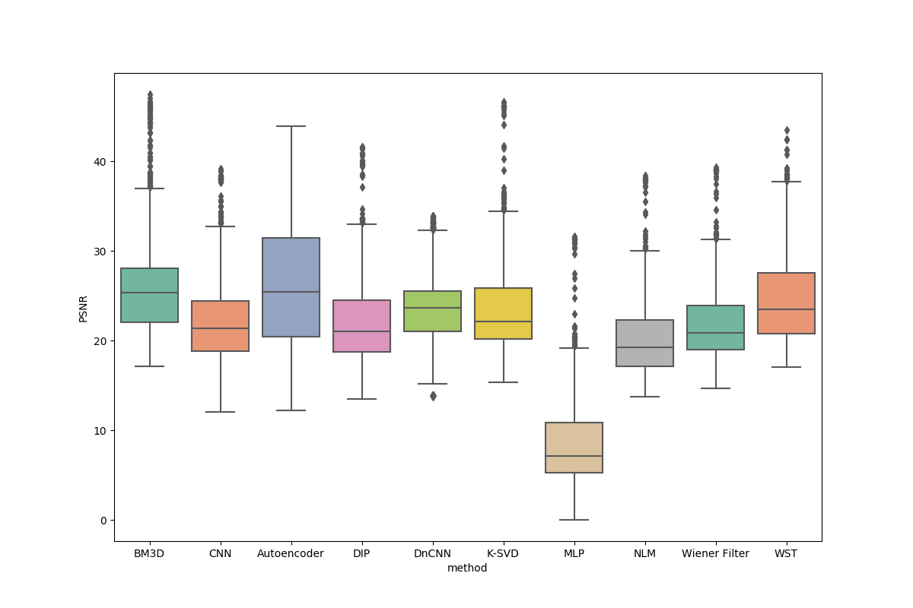
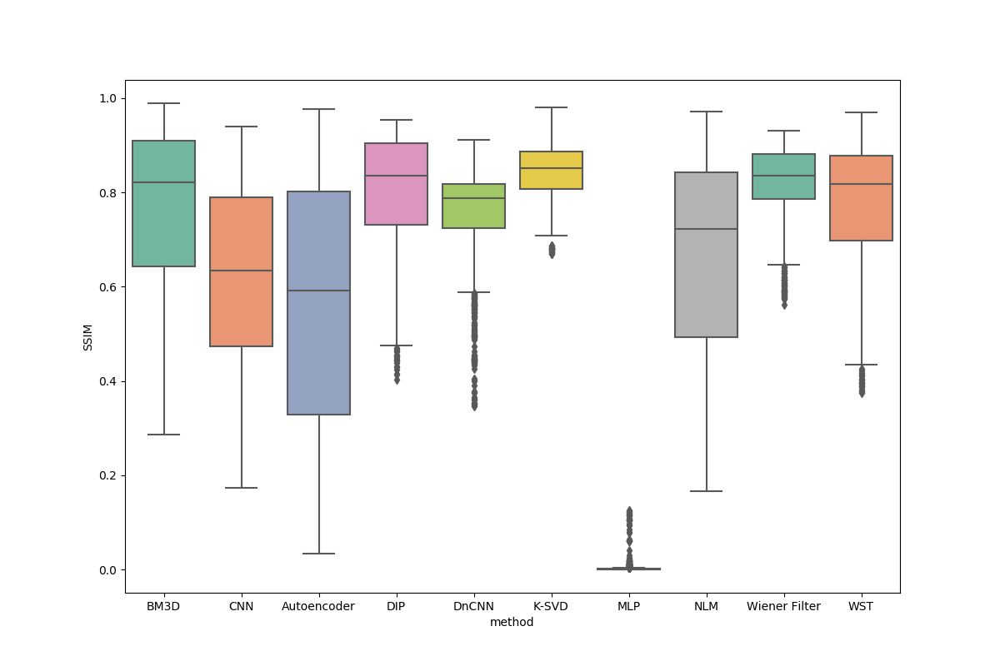
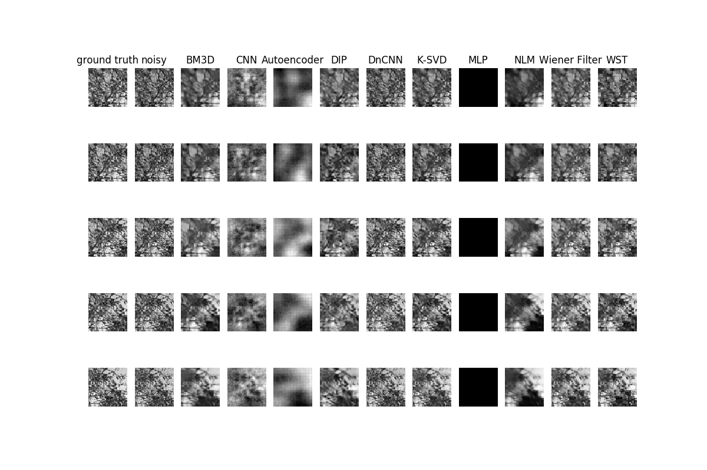
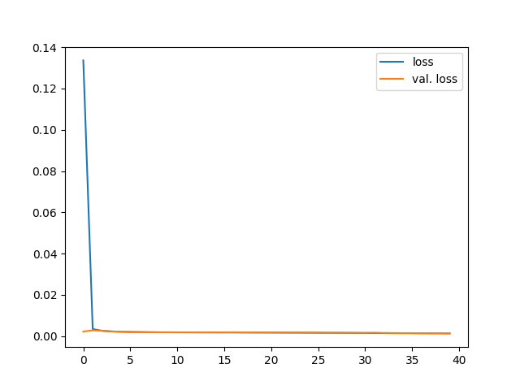

# Poisson Noise 2

Comparing traditional and neural-network bas ed methods in relation to PSNR and SSIM metrics, on Poisson noise.

Experiment started at 2021/05/10 13:34:22 and ended at 2021/05/11 02:38:55, during 13 hours 04 minutes and 32 seconds.

| Methods | Dataset | Training samples | Test samples | Dimension |
|---|---|---|---|---|
| BM3D,CNN,Autoencoder,DIP,DnCNN,K-SVD,MLP,NLM,Wiener Filter and WST | BSD300 | 6000 | 1500 | 52 X 52 |

# 1. Results

## 1.1 Table

We could see the results through the table, comparing all the methods in relation to PSNR and SSIM metrics.

| Method | PSNR (dB) | SSIM | Runtime (seconds) |
|---|---|---|---|
| K-SVD | 23.38 ± 4.8 | 0.84 ± 0.06 | 4934.25 |
| Wiener Filter | 21.75 ± 3.95 | 0.82 ± 0.07 | 1.03 |
| DIP | 21.96 ± 4.5 | 0.8 ± 0.13 | 41848.07 |
| WST | 24.74 ± 4.96 | 0.78 ± 0.13 | 1.47 |
| BM3D | 25.78 ± 5.33 | 0.77 ± 0.17 | 155.26 |
| DnCNN | 23.68 ± 4.01 | 0.76 ± 0.1 | 57.9 |
| NLM | 20.04 ± 3.91 | 0.67 ± 0.22 | 48.2 |
| CNN | 21.95 ± 4.83 | 0.62 ± 0.2 | 14.06 |
| Autoencoder | 26.0 ± 7.24 | 0.56 ± 0.28 | 2.82 |
| MLP | 8.32 ± 4.81 | 0.0 ± 0.02 | 2.2 |
| Noisy | 20.79 ± 4.31 | 0.7 ± 0.17 | --- |

## 1.2 PSNR Boxplot

## 1.3 SSIM Boxplot

## 1.4 Visual Results

## 1.5 DnCNN loss

## How to rerun the experiment?

If you want to rerun this experiment, you could use the `.metadata` directory.
This directory haves all the data, like the train and test data, the value of the PSNR methods in runtime, and data frame (pandas DataFrame) used to generate the Seaborn plots.